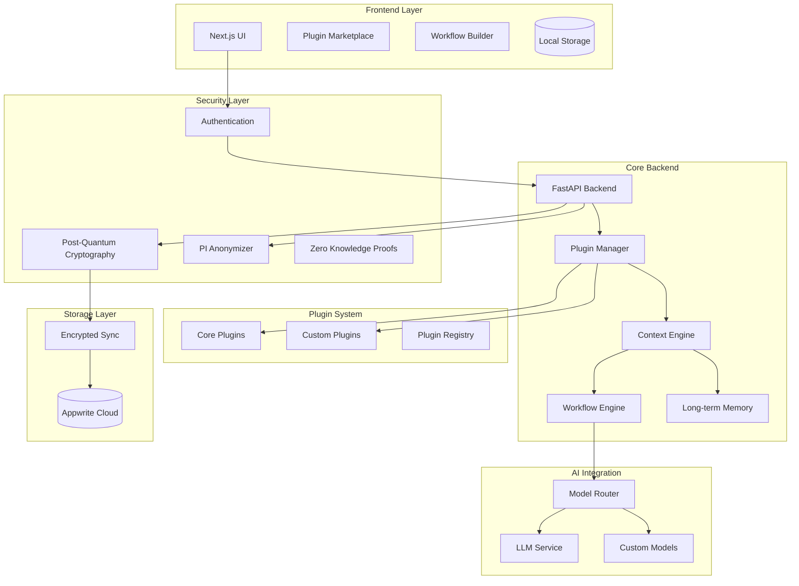
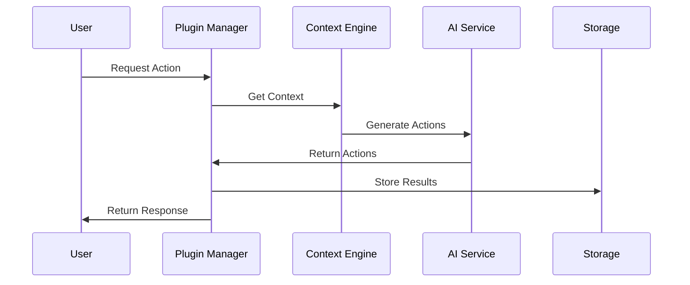
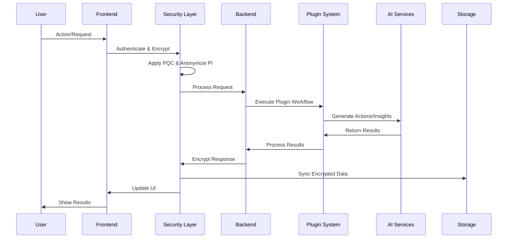
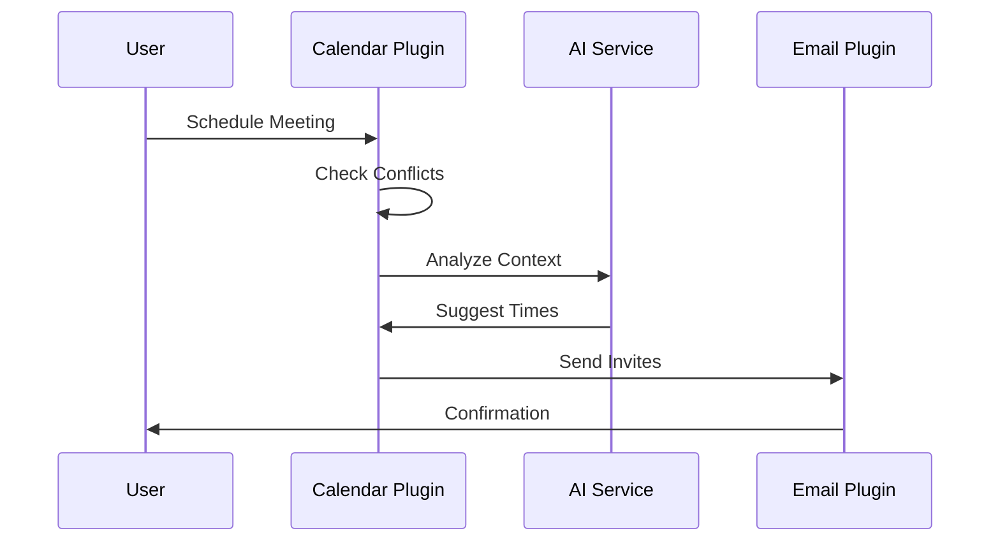
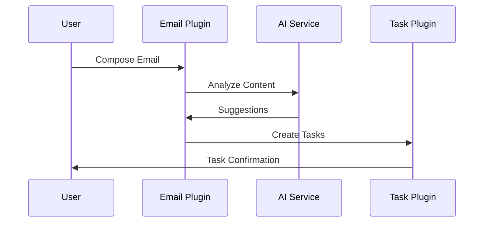
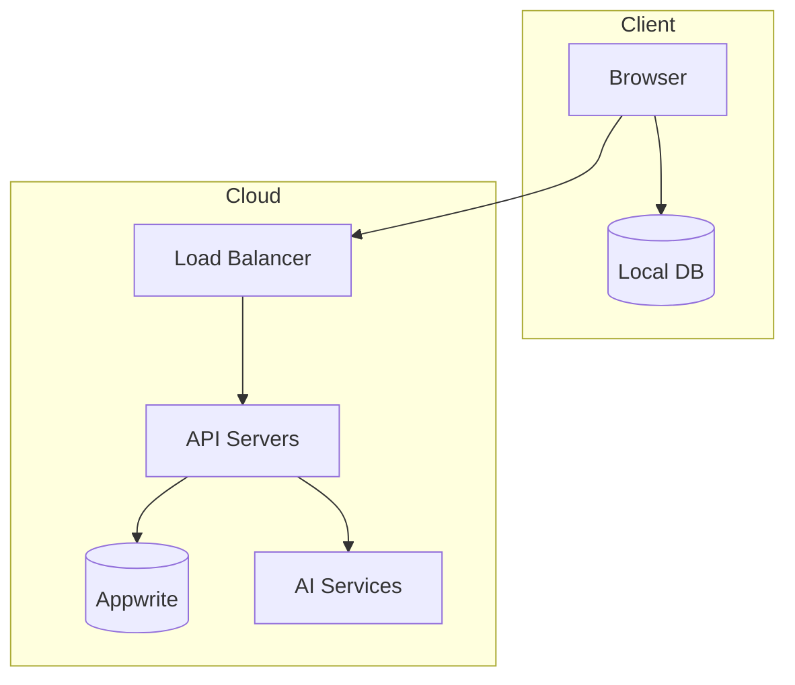

# MyAI-prototype


# MyAI Technical Architecture Documentation

## Table of Contents
- [System Overview](#system-overview)
- [Architecture Components](#architecture-components)
- [Technical Stack](#technical-stack)
- [Core Features](#core-features)
- [Data Flow & Security](#data-flow--security)
- [Plugin System](#plugin-system)


## System Overview

MyAI is a quantum-secure, plugin-based AI assistant that provides personalized digital life management while maintaining strict privacy controls. The system employs a modular architecture with emphasis on data security, extensibility, and intelligent automation.

### High-Level Architecture



## Architecture Components

### 1. Frontend Layer
- **Next.js UI**: Modern, responsive interface
- **Plugin Marketplace**: Directory for discovering and installing plugins
- **Workflow Builder**: Visual tool for creating automated workflows
- **Local Storage**: Encrypted client-side data storage

### 2. Security Layer
- **Post-Quantum Cryptography**: Future-proof encryption
- **PI Anonymizer**: Personal information protection
- **Zero Knowledge Proofs**: Secure data verification
- **Authentication**: Multi-factor secure access

### 3. Core Backend
- **FastAPI Backend**: High-performance API server
- **Plugin Manager**: Plugin lifecycle and execution
- **Context Engine**: User behavior analysis and learning
- **Workflow Engine**: Automated task execution
- **Memory**: Long-term pattern storage

## Technical Stack

### Frontend Technologies
```javascript
{
  "framework": "Next.js 14",
  "styling": "TailwindCSS",
  "state-management": "Redux Toolkit",
  "api-client": "React Query",
  "ui-components": "Shadcn/ui"
}
```

### Backend Technologies
```python
{
  "framework": "FastAPI",
  "database": {
    "local": "SQLite",
    "cloud": "Appwrite"
  },
  "security": {
    "encryption": "Post-Quantum Cryptography",
    "authentication": "JWT + Zero Knowledge Proofs"
  }
}
```

### AI Integration
```python
{
  "model-support": [
    "OpenAI",
    "DeepSeek",
    "Custom Models"
  ],
  
  "processing": "Local-First"
}
```

## Core Features

### 1. Plugin System Architecture



### 2. Data Flow & Security



## Plugin System

### Core Plugins

1. **Email Assistant**
   - Smart response generation
   - Attachment verification
   - Follow-up automation
   ```python
   class EmailPlugin(BasePlugin):
       async def analyze_email(self, content):
           # Analyze email content
           # Generate smart responses
           # Check attachments
   ```

2. **Calendar Coordinator**
   - Conflict detection
   - Smart scheduling
   - Event relationship tracking
   ```python
   class CalendarPlugin(BasePlugin):
       async def check_conflicts(self, event):
           # Check existing events
           # Analyze relationships
           # Generate alternatives
   ```

3. **Task Manager**
   - Task automation
   - Priority management
   - Deadline tracking
   ```python
   class TaskPlugin(BasePlugin):
       async def create_task(self, data):
           # Generate task
           # Set priority
           # Schedule reminders
   ```

## Feature Workflows

### 1. Smart Meeting Scheduling


### 2. Email Processing


## Security Features

1. **Data Protection**
   - Post-quantum encryption
   - Zero-knowledge proofs
   - PI anonymization
   - Encrypted sync

2. **Privacy Measures**
   - Local processing
   - Anonymized AI interactions
   - User-controlled sharing
   - Transparent usage

## Deployment Architecture


